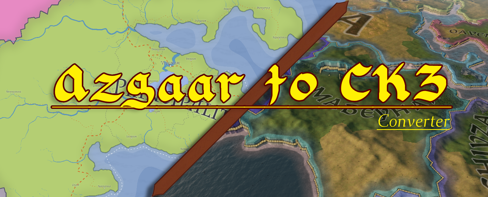

# AzgaarFMGtoCK3
Conversion tool to allow for Random Maps in Crusader Kings 3, by converting from Azgaars Fantasy Map generator https://azgaar.github.io/Fantasy-Map-Generator/

Refer to the project wiki for guidance
[Project wiki ](https://github.com/niefia/AzgaarFMGtoCK3/wiki/Azgaar-to-CK3-Converter-Guide)

Join the [Discord server](https://discord.gg/UrXnsbDRad) to help with development or just get updates

Progress tracked on [Trello](https://trello.com/b/yDIcIxDd/azgaar-ck3) board

## Dev Environment Setup
All development is recommended to use a virtualenv of some kind. 

### Windows
Before installing packages, recommended setup is to install [Conda](https://docs.conda.io/projects/conda/en/latest/user-guide/install/windows.html).

Install packages by runnng `conda install -r requirements.txt`.

In addition, we have a Poetry file in project.toml that can be used. This [SO post](https://stackoverflow.com/questions/70851048/does-it-make-sense-to-use-conda-poetry) describes how to manage.

### Linux
First install Poetry package manager. [Install here](https://python-poetry.org/docs/)

Then run `poetry install`.

